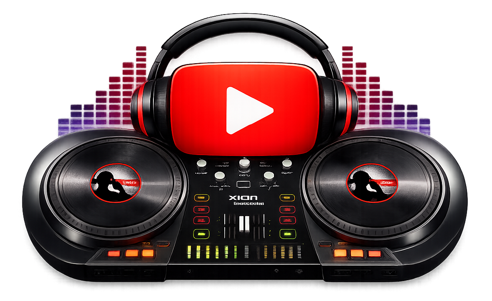
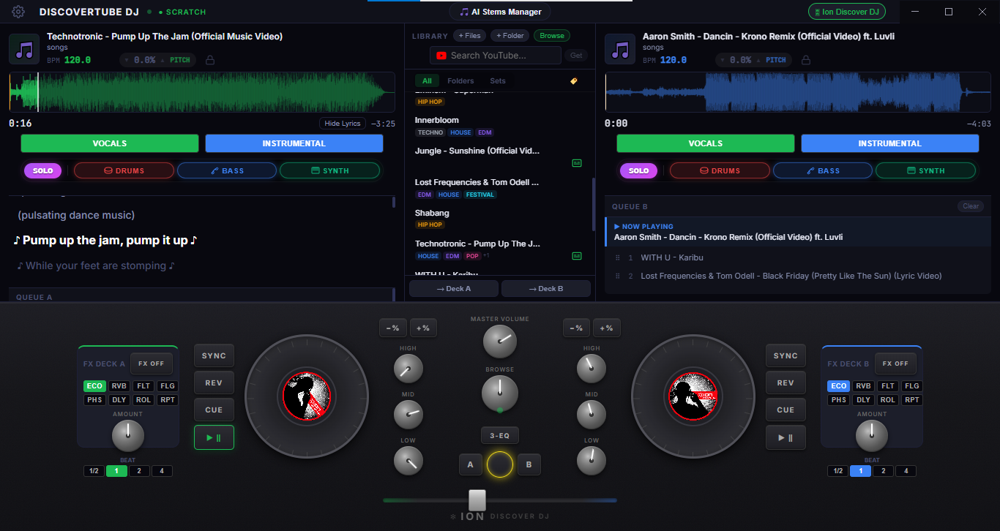
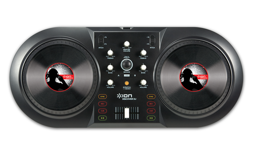

<div align="center">
  
  <h1>DiscoverTube DJ</h1>
  <p>
    
    
    
    
  </p>
</div>

DiscoverTube DJ is a powerful, desktop-based DJ application built with Electron, React, and Vite. It bridges the gap between hardware MIDI controllers (like the ION Discover DJ) and digital mixing, offering a seamless interface for local audio file playback, AI stem separation, on-the-fly music searching and downloading from YouTube.

<div align="center">
  <h3>Screenshot</h3>
  
</div>

<div align="center">
  <h3>Compatible with</h3>
  
  <p><strong>ION Discover DJ</strong></p>
</div>

## 🎛️ Features

- **Dual-Deck Audio Engine**: Real-time scratching, pitch bending, EQ (Treble/Bass), and crossfading powered by the Web Audio API.
- **AI-Powered Stem Separation**: Instantly isolate Vocals, Drums, Bass, and Other instruments from any track on the fly (powered by Demucs).
- **Advanced FX Engine**: Built-in dynamic audio effects including Echo, Reverb, Filter, Modulation, and Repeat.
- **Hardware MIDI Integration**: Connect your USB DJ Controller. Features an intuitive MIDI Learn system to instantly map physical knobs, jog wheels, and buttons to software actions.
- **Smart Browse Modal**: Advanced file system browsing, tag searching, and modal-based library management.
- **Synced Lyrics (Subtitles)**: Real-time karaoke-style lyrics display synchronized with track playback.
- **Settings Configuration**: Customize storage paths and toggle auto-processing behaviors via a dedicated settings modal.
- **Dynamic Track Library**: Load music directly from local folders or individual files.
- **Instant YouTube Fetching**: Search for any song on YouTube and download it directly into your deck without leaving the app.

---

## 🎛️ Controller Support & MIDI Mappings

The application features a universal **MIDI Learn** overlay, allowing it to work with virtually *any* USB MIDI controller. Custom mappings you create are automatically saved securely to your OS's `AppData/Roaming/discovertubedj` directory.

### Pre-configured Mappings
If you own an **ION Discover DJ** controller, we have provided a pre-configured mapping file for you! 

1. Look in the `mappings/` directory of this repository for `ion-discover-dj.json`.
2. Copy this file into your `AppData` directory:
   - **Windows:** `C:\Users\<YourUsername>\AppData\Roaming\discovertubedj\midi-mapping.json`
3. Restart the application. Your controller will instantly work with full LED feedback and scratch support!

---

## 📥 YouTube Download Flow & Quality

One of the standout features of DiscoverTube DJ is its ability to instantly pull tracks from YouTube without requiring an official API key or external encoders.

### How it Works
1. **Search**: The app uses `yt-search` to quickly scrape YouTube for your search query and fetch the correct video URL.
2. **Download**: We use `youtube-dl-exec` (a Node.js wrapper for the industry-standard `yt-dlp`) to stream the audio directly from YouTube servers.
3. **Storage**: Songs are automatically saved permanently into the `DiscoverTubeDJ/songs/` directory so they are cached for instant future playback.

### Audio Quality (Resolution) & Format
- **Format**: Tracks are explicitly downloaded as **WebM (Opus)**. 
- **Quality**: The audio stream is pulled at **~160 kbps (48kHz)**. This is the absolute highest audio quality natively provided by standard YouTube. Because the Opus codec is incredibly efficient, this 160 kbps stream is perceptually identical to a 256–320 kbps MP3.
- **Why WebM?** YouTube serves its high-quality `m4a` streams as fragmented DASH files. Normally, fixing these fragments requires installing `FFmpeg` on the host machine. By downloading the WebM/Opus stream instead, the audio plays *natively and perfectly* within Chromium's Web Audio API, making the app 100% plug-and-play without requiring users to install external media encoders.

---

## 📦 Downloads & Releases

You don't need to build the app from source to use it! 
You can download the pre-packaged, ready-to-run Windows installer directly from the GitHub Releases page:

**[Download DiscoverTube DJ v1.0.0 Setup (.exe) ⬇️](https://github.com/yourusername/discovertubedj/releases/latest)**

*(Simply download, run the installer, and plug in your controller!)*

---

## 🚀 Installation & Setup

### Prerequisites
- [Node.js](https://nodejs.org/) (v16 or higher recommended)
- A connected MIDI DJ Controller (optional, but recommended)

### Getting Started

1. **Clone the repository**
   ```bash
   git clone https://github.com/yourusername/discovertubedj.git
   cd discovertubedj
   ```

2. **Install dependencies**
   ```bash
   npm install
   ```

3. **Run the application**
   ```bash
   npm run dev
   ```
   This will concurrently spin up the Vite React frontend and the Electron backend.

4. **Build for Production**
   ```bash
   npm run build
   ```
   This packages the application into an executable using `electron-builder`.

## 🛠️ Technology Stack
- **Frontend**: React, Vite, Zustand (State Management)
- **Backend**: Electron (Node.js)
- **Audio Processing**: Web Audio API
- **MIDI**: Web MIDI API
- **Scraping/Downloading**: `yt-search`, `youtube-dl-exec` (`yt-dlp`)

## ⚠️ Disclaimer
> This is an independent, community-developed project for the ION Discover DJ. It is not affiliated with or endorsed by ION Audio.

## 📄 License
This project is licensed under the MIT License - see the [LICENSE](LICENSE) file for details.
